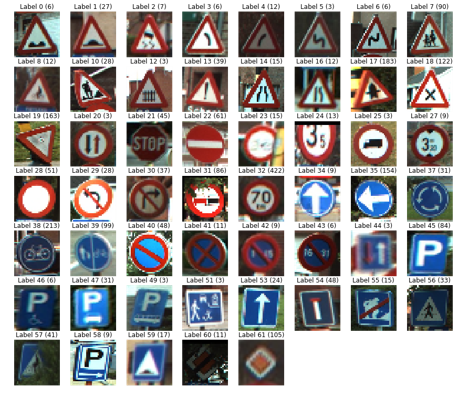
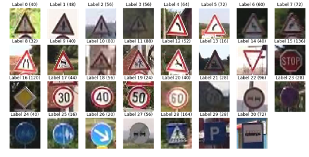
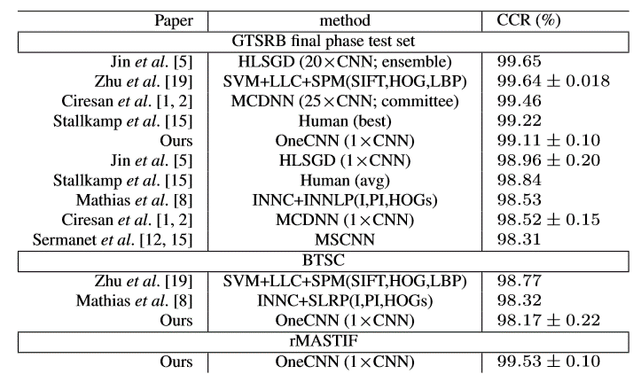

# Traffic Sign Classification using fast.ai library and course
## Introduction
This repo contains 2 notebooks that build and train deep classifiers on both the [Belgium](http://btsd.ethz.ch/shareddata/) and [rMASTIF](http://www.zemris.fer.hr/~kalfa/Datasets/rMASTIF/) traffic sign classification datasets using [fast.ai](http://www.fast.ai/) lesson 1 [course](http://course.fast.ai/lessons/lesson1.html) and [notebook](https://github.com/fastai/fastai/blob/master/courses/dl1/lesson1.ipynb) .

If you're less interested in the code, and just looking for a high-level overview of the work done, I recommend to rather look at [my SlideShare](https://www.slideshare.net/sebderhy/traffic-sign-classification-with-fastai-library-101010467).

I did not train or apply this classifier on the [German traffic signs dataset](http://benchmark.ini.rub.de/?section=gtsrb&subsection=dataset), since [Pavel Surmenok](https://github.com/surmenok) already built a very accurate [fast.ai classifier](https://github.com/surmenok/GTSRB) for this dataset (more details can be found on his [Medium post](https://towardsdatascience.com/resnet-for-traffic-sign-classification-with-pytorch-5883a97bbaa3)).

## Traffic Signs Classes
Here is a visualization of the Belgian traffic signs classes:

And below a visualization of the rMASTIF (Croatian Traffic Signs) classes:

## Notable difference with fast.ai's lesson 1 notebook

The main changes that were made compared to fast.ai lesson 1 notebook are:
- Resnet50 was used instead of Resnet34 as backbone
- No horizontal flips are performed in data augmentation (don't forget we're talking about traffic signs!)
- A very strong Dropout was used given the small size of the dataset in order to prevent from overfitting 
- The [1-cycle policy](https://arxiv.org/abs/1803.09820) was used here with learning rates and weight decay derived from [Sylvain Gugger's notebook](https://github.com/sgugger/Deep-Learning/blob/master/Cyclical%20LR%20and%20momentums.ipynb) to train the networks as efficiently as possible. 
- The part where we train the final layers only (without unfreezing the ResNet layers) using data augmentation was removed, because it did not seem to add value (but I missed something).

## Results
### Prior art
The state-of-the-art on these 2 datasets was mentioned in 2015 by the paper ["OneCNN"](https://www.fer.unizg.hr/_download/repository/ACPR_2015_JurisicFilkovicKalafatic.pdf). 

I could not find more recent and better results on one of these 2 datasets. Below is their results table:

### Results obtained
Using the aforementioned adaptations of the [Dog Vs Cat course](http://course.fast.ai/lessons/lesson1.html) and [notebook](https://github.com/fastai/fastai/blob/master/courses/dl1/lesson1.ipynb), I was able to:
- Reach 99.4% test accuracy on the BTSC dataset, which means that the error is more than 2x smaller than the best result in the table above (Zhu et al., "Traffic sign classification using two-layer image representation", which scored 98.77% accuracy).  
- Reach 99.5% accuracy on the rMASTIF dataset. This is approximately the result that was obtained by [OneCNN](https://www.fer.unizg.hr/_download/repository/ACPR_2015_JurisicFilkovicKalafatic.pdf), which is the best result to my knowledge, but this notebook achieves it in ~3000 iterations (compared to 25K for OneCNN), and using only the rMASTIF dataset (OneCNN trains on the German, Belgian, and rMASTIF datasets).
